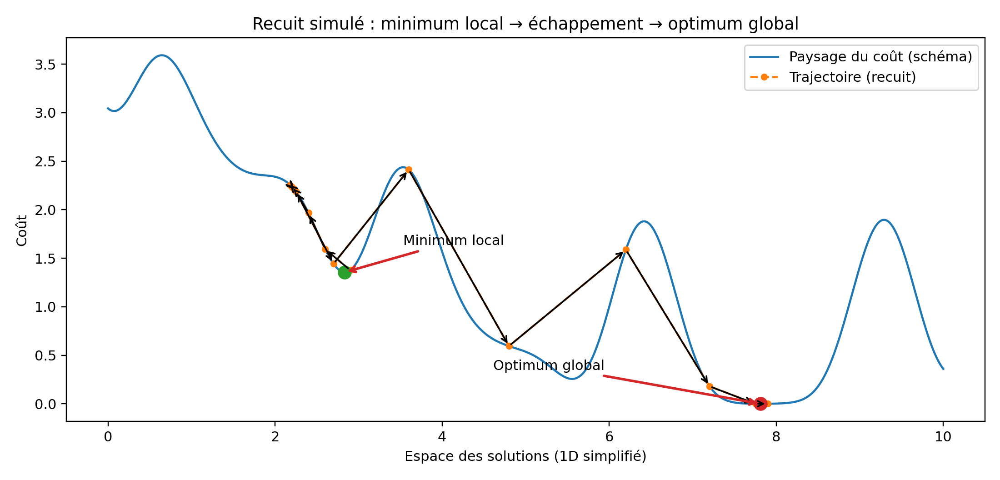

## Projet programmation avancée et applications - Réseau de distribution d'électricité

Ce dépôt contient la version avec **interface utilisateur graphique** du système de gestion de réseau de distribution d'électricité en utilisant **JavaFX**.

---

### Comment exécuter le projet

#### Prérequis

*   Java Development Kit (JDK) 21 ou supérieur.
*   Apache Maven.

#### Compilation et Lancement

Le projet utilise Maven pour la gestion des dépendances et la compilation.

1.  **Lancement simple :**

    Pour compiler le projet et lancer l'application, exécutez la commande suivante à la racine du projet :

    ```bash
    mvn clean javafx:run
    ```

2.  **Lancement avec un fichier de configuration :**

    Pour lancer l'application en chargeant directement un réseau depuis un fichier, vous pouvez passer le chemin du fichier en argument.

    ```bash
    mvn clean javafx:run -Dexec.args="<chemin_vers_le_fichier>"
    ```

    Par exemple :

    ```bash
    mvn clean javafx:run -Dexec.args="instance7.txt"
    ```

---

### Fonctionnalités Clés (GUI)

L'interface graphique est divisée en trois panneaux principaux pour une gestion intuitive :

*   **Vue Réseau (Panneau central) :**
    *   Visualisation dynamique des maisons, des générateurs et de leurs connexions.

*   **Panneau de Contrôle (Panneau de droite) :**
    *   **Gestion du Réseau :** Charger un réseau depuis un fichier ou en créer un nouveau.
    *   **Gestion des Composants :** Ajouter des maisons et des générateurs.
    *   **Gestion des Connexions :** Changer la connexion d'une maison.
    *   **Optimisation :** Lancer l'algorithme d'optimisation pour trouver la meilleure configuration et afficher le coût.

*   **Terminal (Panneau du bas) :**
    *   Affiche des journaux (logs) sur les actions effectuées (chargement, sauvegarde, erreurs, etc.).

---

### Logique Métier (Modèle de Réseau)

Le cœur de la simulation est basé sur les caractéristiques suivantes :

| Élément      | Description                       | Consommation/Capacité                          |
| :----------- | :-------------------------------- |:-----------------------------------------------|
| **Maisons**    | Unités de consommation d'énergie. | Faible : 10 kW, Normale : 20 kW, Forte : 40 kW |
| **Générateurs**| Unités de production d'énergie.   | Capacité configurable.                         |

#### Calcul des Coûts

Le coût total d'une configuration est calculé pour évaluer sa performance, en prenant en compte :

1.  **Déséquilibre de Charge :** Pénalité si la charge totale est loin de la capacité totale (efficacité).
2.  **Surcharge :** Pénalité significative si la demande dépasse la capacité maximale d'un générateur.

---

# Algorithme d’optimisation (`reseau.Optimisation`)

Ce document présente, de manière académique et vérifiable, l’algorithme implémenté dans `reseau.Optimisation` :
construction initiale gloutonne (MRV), recuit simulé adaptatif, descente locale, puis recherche locale itérée (ILS).

---

## 1. Formulation du problème et catégorie

On traite un problème d’affectation : attribuer chaque maison à un générateur afin de minimiser un coût global.

Le problème relève de l’optimisation combinatoire et se rapproche de :
- load balancing (répartition de charge),
- partitionnement / bin packing (NP-difficile en général),
- affectation sous contraintes avec pénalisation des violations (surcharge).

Si |M| est le nombre de maisons et |G| le nombre de générateurs, l’espace des affectations est de l’ordre de |G|^|M|. Une recherche exhaustive n’est donc pas réaliste ; le projet s’appuie sur des métaheuristiques.

---

## 2. Fonction objectif (code : `Reseau.calculCout()`)

Pour chaque générateur g :
- taux d’utilisation : u_g = chargeActuelle_g / capacite_g

Le coût total est défini par :
```text
dispersion = Σ_g |u_g - u_moyen|
surcharge  = Σ_g max(0, u_g - 1)
cout       = dispersion + (penalite * surcharge)
```

Interprétation :
- la dispersion favorise un équilibrage des taux d’utilisation ;
- la pénalité rend les surcharges structurellement défavorables.

---

## 3. Vue d’ensemble de l’algorithme (pseudo-code)

Le plan ci-dessous correspond directement à `Optimisation.optimiser(reseau)`.

```text
optimiser(reseau):
    A) construireSolutionInitiale(reseau)
    B) recuitSimuleAdaptatif(reseau)
    C) descenteLocale(reseau)
    bestSol  ← connexions(reseau)
    bestCost ← cout(reseau)

    D) pour restart de 2 à NB_RESTARTS:
           restaurerSolution(bestSol, reseau)
           perturbationForte(reseau, p)
           recuitSimuleAdaptatif(reseau)
           descenteLocale(reseau)
           si cout(reseau) < bestCost:
               bestCost ← cout(reseau)
               bestSol  ← connexions(reseau)

    restaurerSolution(bestSol, reseau)
    return bestCost
```

---

## 4. Étape A — Construction initiale (glouton MRV)

Méthode : `construireSolutionInitiale(reseau)`

- Tri des maisons par consommation décroissante (priorité aux éléments les plus contraignants).
- Affectation de chaque maison au générateur maximisant un score (méthode `trouverMeilleurGenerateur`) :
  - bonus si capacité restante élevée,
  - bonus si générateur sous-utilisé,
  - pénalisation forte si la maison ne peut pas être accueillie.

Objectif : fournir un point de départ complet et raisonnable pour la métaheuristique.

---

## 5. Étape B — Recuit simulé adaptatif

### 5.1 Voisinage (mouvements)

À chaque itération :
- déplacement : m passe de g1 vers g2 (`tentativeDeplacement`) ;
- swap : échange des générateurs de deux maisons (`tentativeSwap`, probabilité `PROBABILITE_SWAP`).

Le swap élargit le voisinage et facilite des transitions difficiles via déplacements simples.

### 5.2 Règle d’acceptation (Metropolis)

Si Δ = cout_apres - cout_avant :
- si Δ < 0 : le mouvement est accepté ;
- sinon : il est accepté avec probabilité exp(-Δ / T).

### 5.3 Refroidissement adaptatif (par fenêtres)

Toutes les `TAILLE_FENETRE_ADAPTATION` itérations, la vitesse de refroidissement est ajustée selon le taux d’acceptation observé.

### 5.4 Réchauffe (reheating)

Le code applique la règle suivante :
```java
temperature = Math.min(temperature * 15, TEMPERATURE_INITIALE * 0.4);
```

Cette règle ramène la température vers un plafond 0.4·T0 :
- si T < 0.4·T0, la réchauffe augmente T (jusqu’au plafond) ;
- si T > 0.4·T0, la réchauffe diminue T (retour au plafond).


### 5.5 Minima locaux et optimum global (intuition)

Le recuit peut stagner dans un minimum local. Grâce à la température (acceptations probabilistes) et au mécanisme de réchauffe, il peut accepter temporairement des dégradations et sortir du bassin local, puis converger vers une région meilleure.



Note : sur la figure, les flèches noires représentent la trajectoire ; les flèches d’annotation (minimum local / optimum global) sont distinctes.

---

## 6. Étape C — Descente locale

Méthode : `descenteLocale(reseau)`

- Parcours des maisons dans un ordre aléatoire.
- Pour chaque maison, essai de plusieurs générateurs cibles.
- Acceptation uniquement si le coût diminue strictement (Δ < 0).
- Sinon, annulation du mouvement (rollback) pour revenir à l’affectation précédente.

Rôle : phase de finalisation (“polissage”) qui converge vers un optimum local.

---

## 7. Étape D — Recherche locale itérée (ILS) : redémarrages et perturbation

### 7.1 Perturbation forte

Méthode : `perturbationForte(reseau, PROPORTION_PERTURBATION)`

Principe :
- mélanger la liste des maisons ;
- sélectionner k = max(1, floor(p · |M|)) maisons, avec p = `PROPORTION_PERTURBATION` ;
- pour chacune, choisir un générateur différent au hasard et appliquer `changeConnexion`.

But : introduire une dégradation contrôlée afin d’explorer une autre région de l’espace des solutions.

### 7.2 Logique ILS et conservation du meilleur

Après la perturbation, l’algorithme relance recuit simulé puis descente locale. La meilleure solution globale (best-so-far) est conservée sur l’ensemble des restarts.


---

## 8. Analyse de complexité (ordre de grandeur)

Notations : |M| = nombre de maisons, |G| = nombre de générateurs.

Construction initiale :
- tri : O(|M| log |M|)
- choix générateur : O(|M|·|G|)
Total : O(|M| log |M| + |M|·|G|)

Recuit simulé :
- chaque itération déclenche un mouvement et un `calculCout()` parcourant les générateurs : O(|G|)
Si I_SA est le nombre d’itérations effectives :
Total : O(I_SA · |G|), avec une borne via `MAX_ITERATIONS_RECUIT`.

Descente locale :
- essais de déplacements (maison, générateur) et recalculs de coût O(|G|) par tentative
Si I_DL est le nombre d’itérations externes :
Total (pire cas) : O(I_DL · |M| · |G|^2), borné par `MAX_ITERATIONS_DESCENTE`.

ILS :
- répète (perturbation + recuit + descente) `NB_RESTARTS` fois
Total (ordre de grandeur) :
O( NB_RESTARTS · (I_SA·|G| + I_DL·|M|·|G|^2) ) + coût de construction initiale.

---

## 9. Références

1. S. Kirkpatrick, C. D. Gelatt, M. P. Vecchi, “Optimization by Simulated Annealing”, Science, 1983.
2. E. Aarts, J. Korst, Simulated Annealing and Boltzmann Machines, Wiley, 1988.
3. H. R. Lourenço, O. C. Martin, T. Stützle, “Iterated Local Search”, Handbook of Metaheuristics (2e éd.), 2010.
4. E.-G. Talbi, Metaheuristics: From Design to Implementation, Wiley, 2009.

---

## 10. Ouverture : résolution par solveur SAT / Max-SAT / SMT

Le problème peut également être formulé pour un solveur :
- variables booléennes x_(m,g) indiquant l’affectation (chaque maison affectée à un unique générateur) ;
- contraintes d’unicité et de structure ;
- gestion des surcharges via des contraintes supplémentaires ou une formulation d’optimisation (Max-SAT) ;
- optimisation du coût (ou d’une approximation linéarisée) via Max-SAT/SMT.

Une telle approche fournit des garanties (optimalité sous hypothèses, certificats) mais peut devenir coûteuse sur de grandes instances ; l’approche métaheuristique reste adaptée pour obtenir rapidement de bonnes solutions.