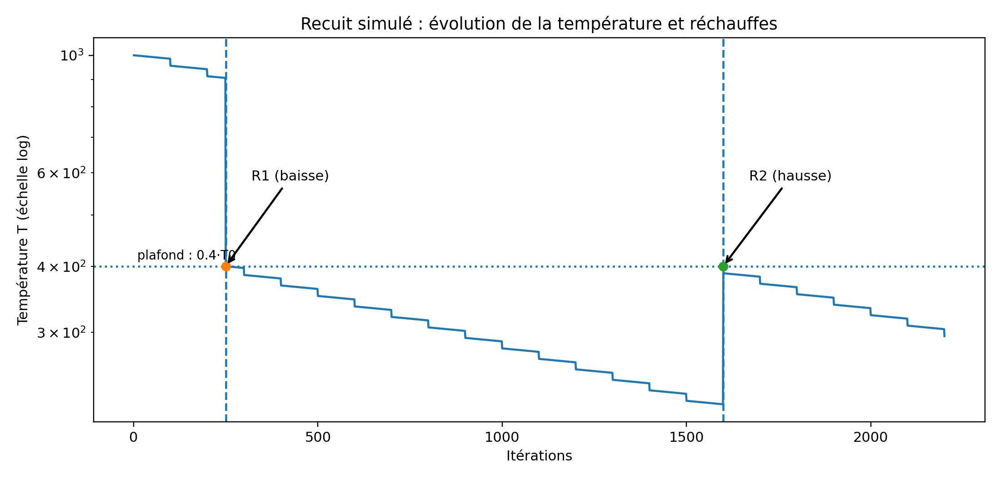
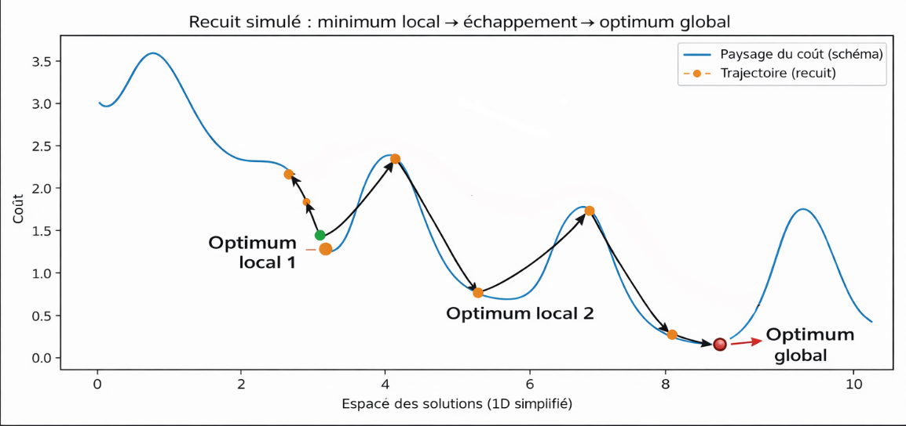
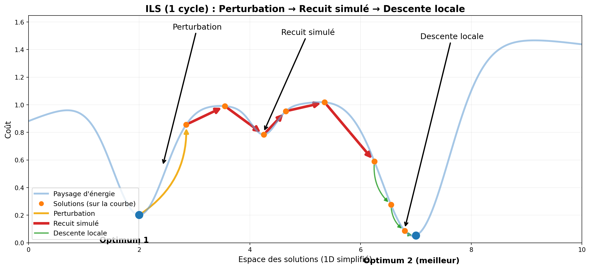

## Projet programmation avancée et applications - Réseau de distribution d'électricité

Ce dépôt contient la version avec **interface utilisateur graphique** du système de gestion de réseau de distribution d'électricité en utilisant **JavaFX**.
Groupe de TD du mercredi matin, Groupe 8 : TASKIN Ozan et BELHARRAT Mohamed

---

### Comment exécuter le projet

#### Prérequis

*   Java Development Kit (JDK) 21 ou supérieur.
*   JavaFX SDK 21.

#### Compilation et Exécution

Pour compiler et exécuter le projet sans Maven, suivez ces étapes :

1.  **Téléchargez JavaFX SDK** : Assurez-vous d'avoir téléchargé le JavaFX SDK (version 21 ou supérieure) et notez le chemin d'accès à son répertoire `lib`. Nous appellerons ce chemin `<CHEMIN_VERS_JAVAFX_LIB>`.

2.  **Compilation** : Ouvrez un terminal à la racine du projet et exécutez la commande suivante pour compiler les fichiers sources :

    ```bash
    mkdir -p target/classes
    javac --module-path <CHEMIN_VERS_JAVAFX_LIB> --add-modules javafx.controls,javafx.fxml -d target/classes $(find src -name "*.java")
    ```

3.  **Exécution** : Après la compilation, vous pouvez exécuter l'application avec la commande suivante :

    ```bash
    java --module-path <CHEMIN_VERS_JAVAFX_LIB>:target/classes --add-modules javafx.controls,javafx.fxml -m ui/main.MainUI
    ```

    Pour lancer l'application en chargeant un réseau depuis un fichier, passez le chemin du fichier en argument :

    ```bash
    java --module-path <CHEMIN_VERS_JAVAFX_LIB>:target/classes --add-modules javafx.controls,javafx.fxml -m ui/main.MainUI <chemin_vers_le_fichier>
    ```

    Pour inclure une valeur de pénalité personnalisée (un nombre flottant) en plus du fichier de configuration :

    ```bash
    java --module-path <CHEMIN_VERS_JAVAFX_LIB>:target/classes --add-modules javafx.controls,javafx.fxml -m ui/main.MainUI <chemin_vers_le_fichier> <valeur_penalite>
    ```

    Par exemple :

    ```bash
    java --module-path <CHEMIN_VERS_JAVAFX_LIB>:target/classes --add-modules javafx.controls,javafx.fxml -m ui/main.MainUI reseau.txt 10.0
    ```

    Vous avez également la possibilité de mettre uniquement la pénalité (par défaut a 10.0) :

    ```bash
    java --module-path <CHEMIN_VERS_JAVAFX_LIB>:target/classes --add-modules javafx.controls,javafx.fxml -m ui/main.MainUI <valeur_penalite>
    ```

NB : Un main sans l'interface graphique est également disponible dans le code en cas de problème dans le package Menu

---

### Fonctionnalités Clés (GUI)

L'interface graphique est divisée en trois panneaux principaux pour une gestion intuitive :

*   **Vue Réseau (Panneau central) :**
    *   Visualisation dynamique des maisons, des générateurs et de leurs connexions.

*   **Panneau de Contrôle (Panneau de droite) :**
    *   **Gestion du Réseau :** Charger un réseau depuis un fichier ou en créer un nouveau.
    *   **Gestion des Composants :** Ajouter des maisons et des générateurs.
    *   **Gestion des Connexions :** Changer la connexion d'une maison.
    *   **Optimisation :** Lancer l'algorithme d'optimisation pour trouver la meilleure configuration et afficher le coût.
    *   Note : Si un fichier est fourni en paramètre au lancement, seuls les boutons 'Optimisation' et 'Sauvegarder' seront visibles.

*   **Terminal (Panneau du bas) :**
    *   Affiche des journaux (logs) sur les actions effectuées (chargement, sauvegarde, erreurs, etc.).

---

### Logique Métier (Modèle de Réseau)

Le cœur de la simulation est basé sur les caractéristiques suivantes :

| Élément      | Description                       | Consommation/Capacité                          |
| :----------- | :-------------------------------- |:-----------------------------------------------|
| **Maisons**    | Unités de consommation d'énergie. | Faible : 10 kW, Normale : 20 kW, Forte : 40 kW |
| **Générateurs**| Unités de production d'énergie.   | Capacité configurable.                         |

#### Calcul des Coûts

Le coût total d'une configuration est calculé pour évaluer sa performance, en prenant en compte :

1.  **Déséquilibre de Charge :** Pénalité si la charge totale est loin de la capacité totale (efficacité).
2.  **Surcharge :** Pénalité significative si la demande dépasse la capacité maximale d'un générateur.

---

# Algorithme d'optimisation (`reseau.Optimisation`)

---

## 1. Formulation du problème et catégorie

On traite un problème d'affectation / allocation : attribuer chaque maison à un générateur afin de minimiser un coût global.

Le problème relève de l'optimisation combinatoire et se rapproche de :
- load balancing (répartition de charge),
- partitionnement / bin packing (NP-difficile en général),
- affectation sous contraintes avec pénalisation des violations (surcharge).

Si |M| est le nombre de maisons et |G| le nombre de générateurs, l'espace des affectations est de l'ordre de |G|^|M|. Une recherche exhaustive n'est donc pas réaliste dans notre cas ; le projet s'appuie sur des métaheuristiques.

---

## 2. Fonction objectif (code : `Reseau.calculCout()`)

Pour chaque générateur g :
- taux d'utilisation : u_g = chargeActuelle_g / capacite_g

Le coût total est défini par :
```text
dispersion = Σ_g |u_g - u_moyen|
surcharge  = Σ_g max(0, u_g - 1)
cout       = dispersion + (penalite * surcharge)
```


- la dispersion favorise un équilibrage des taux d'utilisation ;
- la pénalité rend les surcharges structurellement défavorables.

---

## 3. Vue d'ensemble de l'algorithme (pseudo-code)

Le plan ci-dessous correspond directement à `Optimisation.optimiser(reseau)`.

```text
optimiser(reseau):
    A) construireSolutionInitiale(reseau)
    B) recuitSimuleAdaptatif(reseau)
    C) descenteLocale(reseau)
    bestSol  ← connexions(reseau)
    bestCost ← cout(reseau)

    D) pour restart de 1 à NB_RESTARTS - 1:
           restaurerSolution(bestSol, reseau)
           perturbationForte(reseau, p)
           recuitSimuleAdaptatif(reseau)
           descenteLocale(reseau)
           si cout(reseau) < bestCost:
               bestCost ← cout(reseau)
               bestSol  ← connexions(reseau)

    restaurerSolution(bestSol, reseau)
    return bestCost
```

**Paramètres utilisés :**
- `NB_RESTARTS = 5` (**nombre total de cycles** : 1 cycle initial + `NB_RESTARTS - 1` itérations ILS)


- `TEMPERATURE_INITIALE = 1000.0`


- `TEMPERATURE_MIN = 0.001`


- `MAX_ITERATIONS_RECUIT = 50000` (limite de sécurité)


- `MAX_ITERATIONS_DESCENTE = 1000`


- `TAILLE_FENETRE_ADAPTATION = 100` (adaptation du refroidissement)


- `SEUIL_RECHAUFFE = 800` (stagnation avant réchauffe)


- `MAX_RECHAUFFES = 3` (nombre maximal de réchauffes)


- `PROPORTION_PERTURBATION = 0.3` (30% des maisons perturbées)


- `PROBABILITE_SWAP = 0.3` (30% de swaps vs 70% de déplacements)

---

## 4. Étape A — Construction initiale gloutonne (tri des maisons par consommation décroissante)

Méthode : `construireSolutionInitiale(reseau)`

### 4.1 Principe de l'heuristique

La construction initiale repose sur une heuristique gloutonne de priorisation :
- Les maisons sont triées par consommation **décroissante**
- Les maisons à forte consommation (plus difficiles à placer) sont affectées en premier


### 4.2 Algorithme

```text
construireSolutionInitiale(reseau):
    maisons ← liste(reseau.getMaisons())
    trier(maisons, PAR consommation, ORDRE décroissant)

    // Réinitialiser connexions existantes
    pour chaque (maison, generateur) dans connexions:
        si generateur ≠ null:
            supprConnexion(maison, generateur)

    // Affectation gloutonne
    pour chaque maison m dans maisons:
        g_optimal ← trouverMeilleurGenerateur(m, reseau)
        si g_optimal ≠ null:
            addConnexion(m, g_optimal)
```

### 4.3 Fonction de score (méthode `trouverMeilleurGenerateur`)

Pour chaque générateur candidat g, le score est calculé ainsi :

```text
capaciteRestante ← g.capacite - g.chargeActuelle
taux ← g.chargeActuelle / g.capacite
score ← capaciteRestante × (1.0 - taux)

si capaciteRestante < m.consommation:
    score ← score - 100000  // pénalité massive
```

**Interprétation :**
- Favorise les générateurs avec beaucoup de capacité restante
- Bonus pour les générateurs sous-utilisés (taux faible)
- Pénalité forte (mais pas interdiction absolue) en cas de risque de surcharge

Le générateur ayant le meilleur score est sélectionné.

**Objectif :** Fournir un point de départ complet et raisonnable pour la métaheuristique (éviter de démarrer d'une solution aléatoire de mauvaise qualité).

---

## 5. Étape B — Recuit simulé adaptatif

### 5.1 Voisinage (mouvements)

À chaque itération, l'algorithme choisit aléatoirement un type de mouvement :

**A) Déplacement simple (70% du temps) :** `tentativeDeplacement`
- Sélectionne une maison m (via heuristique cf 5.2)
- Sélectionne un générateur cible g' (via heuristique cf 5.2)
- Applique : m passe de son générateur actuel à g'

**B) Swap (30% du temps) :** `tentativeSwap`
- Sélectionne deux maisons `m1` et `m2` au hasard
- Récupère leurs générateurs actuels `g1` et `g2`
- **Préconditions (sinon le mouvement est rejeté) :**
    - `maisons.size()` > = 2
    - `g1` et `g2` ne sont pas `null`
    - `g1 ≠ g2`
- Si valide, échange les générateurs : `m1 → g2` et `m2 → g1`

**Pourquoi le swap ?** Le mouvement swap permet d'explorer des transitions impossibles via des déplacements simples.

### 5.2 Sélection intelligente des maisons (méthode `choisirMaisonIntelligente`)

Au lieu de choisir purement aléatoirement, l'algorithme identifie les maisons "prioritaires" :

```text
candidatsPrioritaires ← []
tauxMoyen ← reseau.getTauxUtilisationMoyen()

pour chaque maison m:
    g ← générateur actuel de m
    taux_g ← g.calculTauxUtilisation()

    si |taux_g - tauxMoyen| > 0.15 OU taux_g > 1.0:
        ajouter m à candidatsPrioritaires

// 70% : choisir parmi prioritaires, 30% : aléatoire pur
si candidatsPrioritaires non vide ET random() < 0.7:
    retourner choix aléatoire dans candidatsPrioritaires
sinon:
    retourner choix aléatoire dans toutes les maisons
```

**Intuition :** Concentrer les efforts sur les maisons connectées à des générateurs déséquilibrés ou surchargés (principe de Pareto : 80% de l'amélioration vient de 20% des changements).

### 5.3 Sélection intelligente des générateurs (méthode `choisirGenerateurIntelligent`)

Pour une maison m à déplacer, chaque générateur g reçoit un score :

```text
score ← -|taux_g - tauxMoyen|  // privilégie proximité au taux moyen

si taux_g < tauxMoyen:
    score ← score + 0.5  // bonus sous-utilisation

si charge_g + conso_m > capacite_g:
    score ← score - 10.0  // pénalité surcharge
```

Les générateurs sont triés par score décroissant, puis :
- 80% du temps : sélection aléatoire parmi les 3 meilleurs (diversification contrôlée)
- 20% du temps : sélection complètement aléatoire (diversification forte)

### 5.4 Règle d'acceptation (Critère de Metropolis)

Pour un mouvement donné, le coût change de Δ = cout_apres - cout_avant.

**Règle d'acceptation :**
```text
si Δ < 0:
    accepter le mouvement  // amélioration stricte
sinon:
    accepter avec probabilité P = exp(-Δ / T)
```

où `T` est la température courante.

**Interprétation physique :** Cette règle est issue de la distribution de Boltzmann en physique statistique. Elle permet d'accepter probabilistiquement des dégradations temporaires pour échapper aux minima locaux.

### 5.5 Refroidissement adaptatif (par fenêtres)

Le recuit est structuré en **fenêtres** de taille `TAILLE_FENETRE_ADAPTATION = 100`.  
Pendant une fenêtre, la température `T` peut être ajustée en cours de fenêtre par un mécanisme de réchauffe en cas de stagnation.  
De plus, à la fin de chaque fenêtre, `T` est mise à jour **une seule fois** en fonction du **taux d’acceptation des mouvements** sur la fenêtre :

- `acceptationsFenetre` = nombre de mouvements **acceptés** (Δ<0 ou acceptés par Metropolis),
- `tauxAcceptation = acceptationsFenetre / W (W =100)`.

```text
tauxAcceptation ← acceptationsFenetre / W (W = 100)

si tauxAcceptation > 0.85:
    T ← T × 0.95
sinon si tauxAcceptation < 0.15:
    T ← T × 0.985
sinon:
    T ← T × 0.97
```

**Objectif :** Adapter dynamiquement la vitesse de refroidissement selon le comportement observé, sans réglage manuel fastidieux (trop d'accepttation -> refroidir plus vite ; trop peu -> refroidir plus lentement)

### 5.6 Mécanisme de réchauffe (reheating)


**Condition de déclenchement :** (stagnation strictement supérieure au seuil)

```java
if (iterationsSansAmelioration > SEUIL_RECHAUFFE && nombreRechauffes < MAX_RECHAUFFES) {
temperature = Math.min(temperature * 15.0, TEMPERATURE_INITIALE * 0.4);
iterationsSansAmelioration = 0;
nombreRechauffes++;
        }
```        

**Interprétation :**
- Si aucune amélioration depuis plus de `SEUIL_RECHAUFFE = 800` itérations → stagnation détectée
- Réchauffe appliquée : `T ← min(15 × T, 0.4 × T0)` avec `T0 = TEMPERATURE_INITIALE`
- Effet :
    - si `T < 0.4 × T0`, alors `T` augmente (jusqu’au plafond),
    - si `T ≥ 0.4 × T0`, alors `T` est fixé au plafond `0.4 × T0` (ce qui peut donc diminuer `T`)
    - Limité à `MAX_RECHAUFFES = 3` réchauffes par phase de recuit


- **Objectif :** Sortir d'un bassin d'attraction en réaugmentant temporairement la probabilité d'accepter des dégradations, permettant ainsi de franchir des barrières énergétiques et d'explorer de nouveaux bassins.




**Figure 1 : Évolution de la température avec plafonnement et “réchauffes” (R1, R2)**  
Ce graphique montre l’évolution de la température `T` (échelle logarithmique) au cours des itérations du recuit simulé. La température décroît par paliers car elle est principalement mise à jour à la fin de fenêtres de 100 itérations (refroidissement adaptatif).

Lorsqu’une stagnation est détectée, un mécanisme de “réchauffe” peut également modifier `T` *au cours d’une fenêtre* via la règle suivante :

`T = min(15 * T, 0.4 * T0)`

où `T0` est la température initiale. Cette règle ramène `T` vers un plafond fixé à `0.4 * T0 = 400` (ligne pointillée). Selon la valeur de `T` au moment du déclenchement, l’événement peut :
- **augmenter** `T` jusqu’au plafond (cas illustré par R2 vers ~1600 itérations), ou
- **ramener** `T` au plafond si `T` était encore au-dessus (cas illustré par R1 vers ~250 itérations).

Dans les deux cas, l’objectif est de relancer l’exploration en modifiant brutalement le niveau d’acceptation des mouvements.

### 5.7 Minima locaux et optimum global (intuition)

Le recuit simulé peut stagner dans un minimum local. Grâce à la température (acceptations probabilistes) et au mécanisme de réchauffe, il peut accepter temporairement des dégradations et sortir du bassin local, puis converger vers une région meilleure.



**Figure 2 : Trajectoire du recuit simulé dans le paysage d'optimisation**  
Ce graphique illustre conceptuellement le parcours de l'algorithme dans l'espace des solutions (axe X) avec le coût associé (axe Y). La courbe bleue représente le "paysage énergétique" avec plusieurs vallées (optima locaux). La trajectoire orange montre comment le recuit :
1. Descend vers un premier optimum local (vallée de gauche, coût ~1.3)
2. Accepte des dégradations temporaires grâce à la température (remontées vers coût ~2.2)
3. Franchit la barrière et descend vers un deuxième optimum local (coût ~0.8)
4. Continue à explorer et finit par atteindre l'optimum global (vallée de droite, coût ~0.1 marqué par un cercle rouge)

Les flèches noires indiquent la progression de la recherche. Sans acceptation probabiliste de dégradations, l'algorithme resterait piégé dans le premier minimum local.

---

## 6. Étape C — Descente locale

Méthode : `descenteLocale(reseau)`

### 6.1 Algorithme

```text
descenteLocale(reseau):
    amelioration ← vrai
    iterations ← 0

    tant que amelioration ET iterations < MAX_ITERATIONS_DESCENTE:
        amelioration ← faux
        iterations ← iterations + 1

        maisons ← melanger(liste des maisons)

        pour chaque maison m dans maisons:
            g_actuel ← générateur actuel de m
            generateurs ← melanger(liste des générateurs)

            pour chaque g_nouveau dans generateurs:
                si g_actuel = g_nouveau: continuer

                coutAvant ← reseau.getCout()
                changeConnexion(m, g_actuel, g_nouveau)
                reseau.calculCout()
                coutApres ← reseau.getCout()

                si coutApres < coutAvant:
                    amelioration ← vrai
                    g_actuel ← g_nouveau  // garder le changement
                sinon:
                    // Rollback
                    changeConnexion(m, g_nouveau, g_actuel)
                    reseau.calculCout()
```

### 6.2 Différence avec le recuit

**Différences clés :**
- **Aucune acceptation probabiliste** : seules les améliorations strictes (Δ < 0) sont acceptées
- **Pas de température** : comportement purement déterministe (à ordre de parcours aléatoire près)
- **Convergence garantie** : s'arrête nécessairement sur un optimum local

**Rôle :** Phase de finalisation ("polissage") qui converge vers le fond exact du bassin d'attraction exploré par le recuit.

---

## 7. Étape D — Recherche locale itérée (ILS) : perturbations et redémarrages

### 7.1 Principe d'ILS

Au lieu de relancer l'optimisation depuis zéro (multi-start), ILS applique le schéma suivant :
1. Partir de la meilleure solution connue
2. Appliquer une **perturbation contrôlée** (ni trop faible, ni trop forte)
3. Réoptimiser (recuit + descente)
4. Conserver si meilleur que le best-so-far, sinon rejeter

**Avantages sur multi-start pur :**
- Conserve une partie de la structure de la bonne solution
- Explore d'autres bassins d'attraction sans perdre complètement l'information acquise
- Plus efficace pour des problèmes structurés

### 7.2 Perturbation forte (méthode `perturbationForte`)

```text
perturbationForte(reseau, proportion):
    maisons ← melanger(liste des maisons)
    generateurs ← liste des générateurs

    k ← max(1, floor(proportion × |maisons|))

    pour i de 0 à k-1:
        m ← maisons[i]
        g_actuel ← générateur actuel de m

        autresGenerateurs ← generateurs \ {g_actuel}

        si autresGenerateurs non vide:
            g_nouveau ← choix aléatoire dans autresGenerateurs
            changeConnexion(m, g_actuel, g_nouveau)

    reseau.calculCout()
```

**Avec `PROPORTION_PERTURBATION = 0.3` :**
- 30% des maisons sont déplacées aléatoirement
- Force suffisante pour sortir du bassin d'attraction actuel
- Pas trop forte pour conserver une partie de la structure

**Pourquoi 30% ?** C'est un compromis empirique documenté dans la littérature ILS :
- Trop faible (< 10%) : risque de rester dans le même bassin
- Trop forte (> 50%) : perte excessive d'information, comportement proche d'un restart pur

### 7.3 Boucle ILS et critère d'acceptation

```text
// Après initialisation et première optimisation
bestSol ← connexions(reseau)
bestCost ← cout(reseau)

pour restart de 1 à NB_RESTARTS - 1:
    // 1) Restaurer meilleure solution
    restaurerSolution(bestSol, reseau)

    // 2) Perturber
    perturbationForte(reseau, 0.3)

    // 3) Réoptimiser
    recuitSimuleAdaptatif(reseau)
    descenteLocale(reseau)

    // 4) Critère d'acceptation élitiste
    si cout(reseau) < bestCost:
        bestCost ← cout(reseau)
        bestSol ← connexions(reseau)
```

**Critère d'acceptation :** Élitiste strict (on ne conserve que si amélioration). Alternative possible : critère de Metropolis avec température propre à ILS (non implémenté ici).



**Figure 3 : Un cycle complet d'ILS (Perturbation → Recuit → Descente)**  
Ce graphique montre un cycle typique d'ILS dans le paysage d'optimisation (courbe bleue claire). L'algorithme :
1. Part d'un optimum local (Optimum 1, cercle bleu en vallée gauche)
2. **Perturbation** (flèche orange) : déplacement brutal de 30% des maisons, ce qui "éjecte" la solution de son bassin vers une autre région
3. **Recuit simulé** (ligne rouge avec points orange) : exploration avec acceptation probabiliste, descente progressive avec quelques remontées
4. **Descente locale** (ligne verte) : convergence déterministe vers le fond de la nouvelle vallée
5. Résultat : nouvel optimum local (Optimum 2, cercle bleu en vallée droite) qui est meilleur que le précédent

Ce cycle est répété 4 fois (`NB_RESTARTS - 1 (Initial) = 4`) dans l'algorithme, en conservant toujours la meilleure solution globale rencontrée.

---

## 8. Analyse de complexité (ordre de grandeur)

Notations : |M| = nombre de maisons, |G| = nombre de générateurs.

### 8.1 Construction initiale

- Tri : O(|M| log |M|)
- Choix générateur pour chaque maison : O(|M|·|G|)

**Total :** O(|M| log |M| + |M|·|G|)

### 8.2 Recuit simulé

Chaque itération :
- Un mouvement (déplacement ou swap) : O(1)
- Recalcul complet du coût (`calculCout()`) : O(|G|)

Si I_SA est le nombre d'itérations effectives (borné par `MAX_ITERATIONS_RECUIT = 50000`) :

**Total :** O(I_SA · |G|)

**Remarque :** Le recalcul complet du coût à chaque itération est coûteux. Une optimisation possible serait un calcul incrémental du delta (Δ-cost local), mais ce n'est pas implémenté ici.

### 8.3 Descente locale

Chaque itération externe :
- Parcourt toutes les maisons : O(|M|)
- Pour chaque maison, teste tous les générateurs : O(|G|)
- Chaque test déclenche un recalcul de coût : O(|G|)

Si I_DL est le nombre d'itérations externes (borné par `MAX_ITERATIONS_DESCENTE = 1000`) :

**Total (pire cas) :** O(I_DL · |M| · |G|²)

En pratique, la convergence est rapide (5-10 itérations typiquement car peu d'améliorations restent).

### 8.4 ILS complet

ILS répète `NB_RESTARTS = 4` fois : (perturbation + recuit + descente)
- Perturbation : O(|M|) (parcours + affectations)
- Recuit : O(I_SA · |G|)
- Descente : O(I_DL · |M| · |G|²)

**Total (ordre de grandeur) :**

O(NB_RESTARTS · (I_SA·|G| + I_DL·|M|·|G|²)) + O(|M| log |M| + |M|·|G|)

Avec les valeurs typiques (|M| = 100, |G| = 10, I_SA ≈ 10000, I_DL ≈ 10) :
- Construction : ~1000 opérations
- Recuit par phase : ~100 000 opérations
- Descente par phase : ~100 000 opérations
- ILS (5 restarts) : ~1 000 000 opérations


---

## 9.2 Pourquoi cet algorithme est adapté au problème

**Nature du paysage de recherche :**
- Multimodalité (nombreux optima locaux)
- Plateaux (zones où nombreuses solutions ont coût similaire)
- Forte non-linéarité (composante dispersion + discontinuités surcharges)

→ ILS + Recuit simulé sont particulièrement efficaces sur ces caractéristiques

**Structure des contraintes :**
- Contraintes souples (dispersion) : gérées par fonction objectif
- Contraintes dures (capacité totale) : gérées par construction
- Contraintes hybrides (surcharges individuelles) : pénalité λ

→ Approche métaheuristique plus adaptée que PLNE pour contraintes mixtes

**Taille des instances :**
- Trop grand pour énumération exhaustive (|G|^|M| possibilités)
- Trop petit pour métaheuristiques populationnelles lourdes (AG, PSO)
- Idéal pour recherches locales itérées


## 10. Références

### 10.1 Articles fondateurs

1. **S. Kirkpatrick, C. D. Gelatt, M. P. Vecchi (1983)**  
   "Optimization by Simulated Annealing"  
   *Science*, 220(4598), 671-680.  
   (Article fondateur du recuit simulé, analogie avec le recuit métallurgique)

2. **N. Metropolis, A. W. Rosenbluth, M. N. Rosenbluth, A. H. Teller, E. Teller (1953)**  
   "Equation of State Calculations by Fast Computing Machines"  
   *The Journal of Chemical Physics*, 21(6), 1087-1092.  
   (Critère de Metropolis, base du recuit simulé)

3. **H. R. Lourenço, O. C. Martin, T. Stützle (2010)**  
   "Iterated Local Search"  
   *Handbook of Metaheuristics* (2nd edition), Springer, 320-353.  
   (Référence principale pour ILS, perturbations + critères d'acceptation)

### 10.2 Ouvrages de référence

4. **E. Aarts, J. Korst (1988)**  
   *Simulated Annealing and Boltzmann Machines*  
   Wiley.  
   (Analyse théorique du recuit, schedules de refroidissement)

5. **E.-G. Talbi (2009)**  
   *Metaheuristics: From Design to Implementation*  
   Wiley.  
   (Vue d'ensemble des métaheuristiques, comparaisons, choix algorithmiques)

6. **S. Russell, P. Norvig (2020)**  
   *Artificial Intelligence: A Modern Approach* (4th edition)  
   Pearson, Chapter 6: Constraint Satisfaction Problems.  
   (Heuristique MRV, variable ordering dans les CSP)

### 10.3 Articles spécialisés

7. **P. Salamon, P. Sibani, R. Frost (2010)**  
   "Investigation of Acceptance Simulated Annealing — A Simplified Approach to Adaptive Cooling Schedules"  
   *European Physical Journal B*, 76(4), 447-453.  
   (Schedules adaptatifs basés sur le taux d'acceptation)

---
